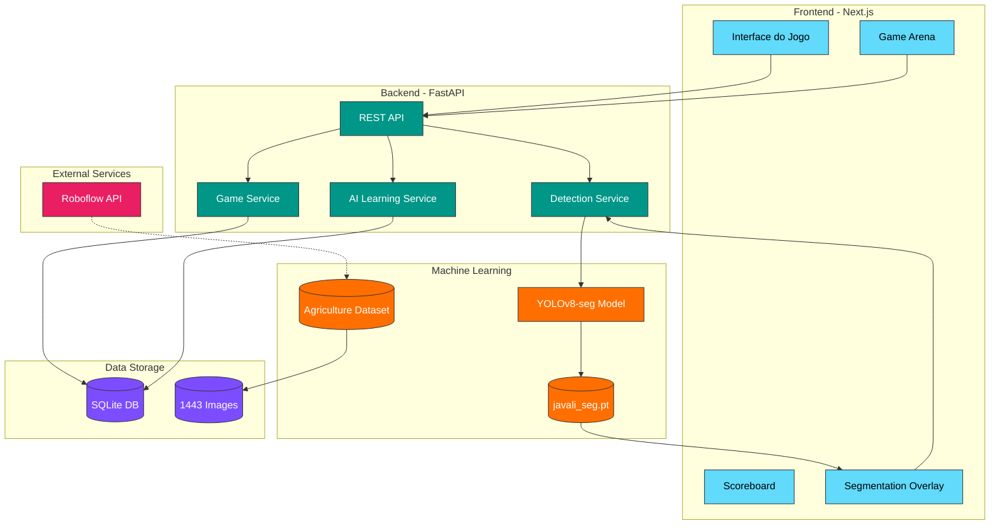
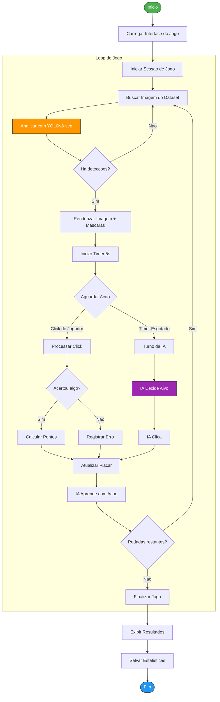
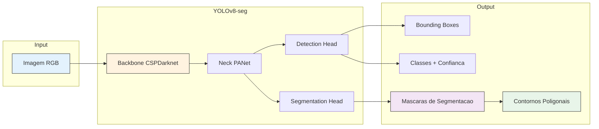
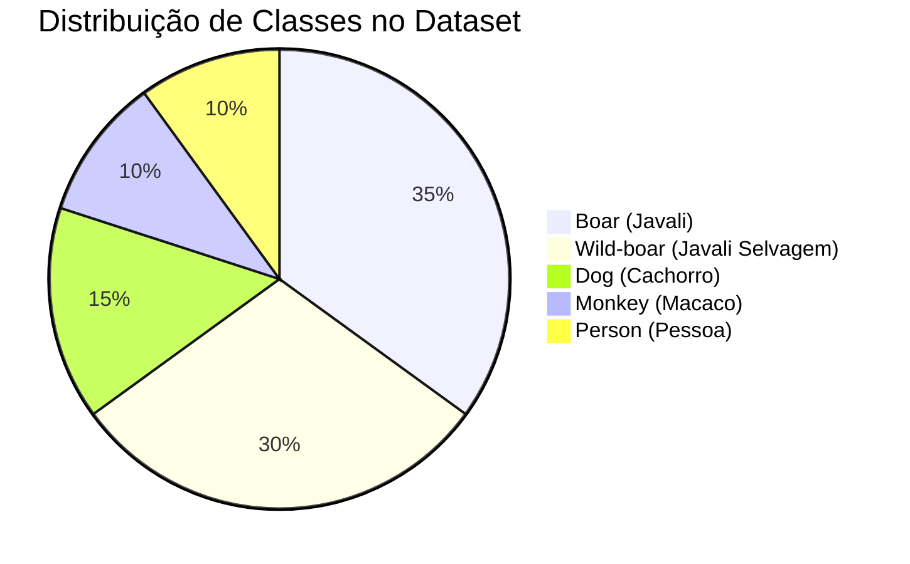
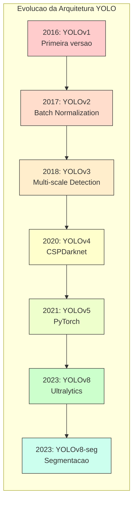
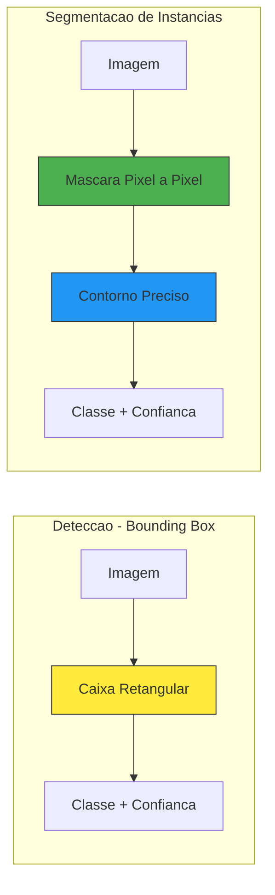
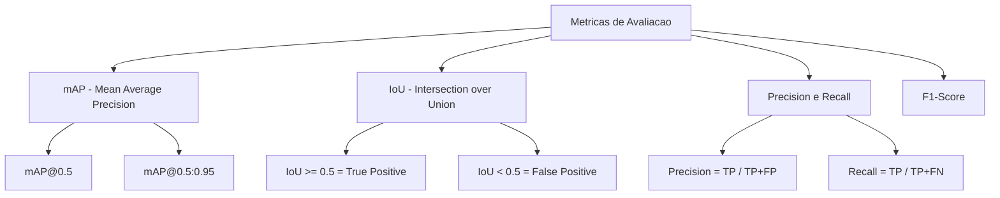
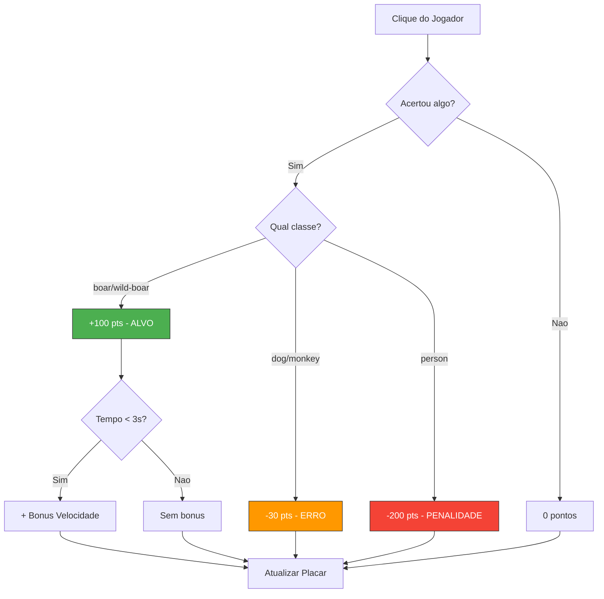

# 🐗 Javali Hunter - Sistema de Detecção e Segmentação via Visão Computacional

<div align="center">


**Sistema gamificado de detecção e segmentação de javalis (Sus scrofa) usando Visão Computacional com YOLOv8-seg.**

🎮 **Competição: Humano vs IA!** 🤖

[](LICENSE)
[](https://python.org)
[](https://nextjs.org)
[](https://ultralytics.com)
[](https://fastapi.tiangolo.com)
[](https://universe.roboflow.com/htw-8xh8b/agriculture-jwqz1)

</div>

---

## 📑 Índice

- [Sobre o Projeto](#-sobre-o-projeto)
- [Big Picture - Visão Geral](#-big-picture---visão-geral)
- [Fluxograma do Sistema](#-fluxograma-do-sistema)
- [Tecnologias e Bibliotecas](#-tecnologias-e-bibliotecas)
- [Dataset Agriculture (HTW)](#-dataset-agriculture-htw)
- [YOLO e Técnicas de Segmentação](#-yolo-e-técnicas-de-segmentação)
- [Arquitetura do Projeto](#-arquitetura-do-projeto)
- [Instalação e Execução](#-instalação-e-execução)
- [API Endpoints](#-api-endpoints)
- [Sistema de Pontuação](#-sistema-de-pontuação)
- [Segurança e Ética](#-segurança-e-ética)
- [Referências](#-referências)
- [Autores](#-autores)

---

## 📋 Sobre o Projeto

Este projeto foi desenvolvido para a disciplina de **Tópicos Avançados em Inteligência Artificial** da UFSC, com foco em detectar e segmentar espécies invasoras (javali e javaporco) em imagens agrícolas usando técnicas avançadas de **Visão Computacional**.

### 🎯 Objetivo

Criar um sistema interativo e educacional que demonstra a aplicação prática de **Deep Learning** para detecção de fauna, gamificando a experiência através de uma competição entre humano e IA.

### 🎮 Mecânica do Jogo

| Ação | Pontuação | Descrição |
|------|-----------|-----------|
| ✅ Acertar javali | **+100 pts** | Alvo principal (+ bônus por velocidade) |
| ⚠️ Acertar outro animal | **-30 pts** | Penalidade por erro |
| 🚫 Acertar humano | **-200 pts** | Penalidade severa! |
| 🤖 IA Adaptativa | - | A IA aprende com seus acertos e erros |

---

## 🌐 Big Picture - Visão Geral

O diagrama abaixo apresenta a visão geral de todo o sistema, mostrando como os componentes se integram:



---

## 🔄 Fluxograma do Sistema

O fluxograma abaixo detalha o processo completo de uma partida, desde o início até a exibição dos resultados:



### 📊 Fluxo de Detecção e Segmentação



---

## 🛠️ Tecnologias e Bibliotecas

### Backend (Python 3.10+)

| Biblioteca | Versão | Descrição |
|------------|--------|-----------|
| **FastAPI** | ≥0.109 | Framework web assíncrono de alta performance |
| **Uvicorn** | ≥0.27 | Servidor ASGI para FastAPI |
| **Ultralytics** | ≥8.1 | YOLOv8 para detecção e segmentação |
| **PyTorch** | ≥2.2 | Framework de Deep Learning |
| **OpenCV** | ≥4.9 | Processamento de imagens |
| **Pillow** | ≥10.2 | Manipulação de imagens |
| **NumPy** | ≥1.26 | Computação numérica |
| **Pydantic** | ≥2.5 | Validação de dados |
| **SQLAlchemy** | ≥2.0 | ORM para banco de dados |
| **scikit-learn** | ≥1.4 | Utilitários de ML |

### Frontend (Node.js 18+)

| Biblioteca | Versão | Descrição |
|------------|--------|-----------|
| **Next.js** | 14.0.4 | Framework React com SSR |
| **React** | 18.2 | Biblioteca de UI |
| **TypeScript** | 5.3 | Tipagem estática |
| **Tailwind CSS** | 3.4 | Framework CSS utilitário |
| **Zustand** | 4.4 | Gerenciamento de estado |
| **Framer Motion** | 10.18 | Animações fluidas |
| **Axios** | 1.6 | Cliente HTTP |
| **Howler** | 2.2 | Efeitos sonoros |

### Machine Learning

| Ferramenta | Descrição |
|------------|-----------|
| **YOLOv8n-seg** | Modelo de segmentação de instâncias (nano) |
| **Roboflow** | Plataforma de datasets e anotações |
| **CUDA** | Aceleração GPU (opcional) |

---

## 📦 Dataset Agriculture (HTW)

### Sobre o Roboflow

[Roboflow](https://roboflow.com) é uma plataforma líder em visão computacional que oferece:

- 🏷️ **Anotação de imagens** com ferramentas colaborativas
- 🔄 **Augmentação de dados** automática
- 📊 **Versionamento** de datasets
- 🚀 **Deploy** de modelos treinados
- 🌐 **Roboflow Universe**: repositório público de datasets

### Agriculture Computer Vision Dataset

O dataset utilizado neste projeto é o [**Agriculture (HTW)**](https://universe.roboflow.com/htw-8xh8b/agriculture-jwqz1), disponível no Roboflow Universe.

| Informação | Valor |
|------------|-------|
| **Fonte** | HTW Berlin / Roboflow Universe |
| **Total de Imagens** | 1.443 |
| **Treinamento** | 1.011 imagens (70%) |
| **Validação** | 288 imagens (20%) |
| **Teste** | 144 imagens (10%) |
| **Formato** | YOLO (TXT + imagens) |
| **Resolução** | 640x640 px |

### Classes do Modelo



| ID | Classe | Tipo | Pontuação |
|----|--------|------|-----------|
| 0 | `boar` | 🎯 ALVO | +100 pts |
| 1 | `wild-boar` | 🎯 ALVO | +100 pts |
| 2 | `dog` | ⚠️ Distrator | -30 pts |
| 3 | `monkey` | ⚠️ Distrator | -30 pts |
| 4 | `person` | 🚫 PENALIDADE | -200 pts |

---

## 🔬 YOLO e Técnicas de Segmentação

### O que é YOLO?

**YOLO (You Only Look Once)** é uma família de modelos de detecção de objetos em tempo real. Diferente de métodos tradicionais que processam a imagem múltiplas vezes, YOLO processa a imagem inteira em uma única passagem, tornando-o extremamente rápido.

### Evolução do YOLO



### YOLOv8-seg: Segmentação de Instâncias

O **YOLOv8-seg** estende o YOLOv8 adicionando uma "cabeça" de segmentação que produz máscaras pixel a pixel para cada objeto detectado.

#### Diferença entre Detecção e Segmentação



#### Vantagens da Segmentação

1. **Precisão**: Contornos exatos do animal, não apenas uma caixa retangular
2. **Oclusão**: Melhor tratamento de objetos parcialmente ocultos
3. **Gameplay**: Clicks mais precisos no jogo
4. **Visualização**: Overlays de máscara mais informativos

### Arquitetura do YOLOv8-seg

```
┌─────────────────────────────────────────────────────────────┐
│                    YOLOv8-seg Architecture                   │
├─────────────────────────────────────────────────────────────┤
│                                                              │
│  ┌──────────────┐    ┌──────────────┐    ┌──────────────┐   │
│  │   Backbone   │───▶│     Neck     │───▶│    Heads     │   │
│  │  CSPDarknet  │    │    PANet     │    │              │   │
│  └──────────────┘    └──────────────┘    │  ┌────────┐  │   │
│                                          │  │Detection│  │   │
│  Features:                               │  │  Head   │  │   │
│  • Conv layers                           │  └────────┘  │   │
│  • C2f blocks                            │              │   │
│  • SPPF                                  │  ┌────────┐  │   │
│                                          │  │  Seg   │  │   │
│                                          │  │  Head  │  │   │
│                                          │  └────────┘  │   │
│                                          └──────────────┘   │
└─────────────────────────────────────────────────────────────┘
```

### Técnicas de Visão Computacional Utilizadas

| Técnica | Descrição | Uso no Projeto |
|---------|-----------|----------------|
| **Convolução** | Filtros para extrair features | Backbone do YOLO |
| **Pooling** | Redução de dimensionalidade | SPP (Spatial Pyramid Pooling) |
| **Skip Connections** | Conexões residuais | PANet para multi-escala |
| **NMS** | Non-Maximum Suppression | Eliminar detecções duplicadas |
| **IoU** | Intersection over Union | Avaliação de precisão |
| **Anchor-free** | Detecção sem âncoras | YOLOv8 moderno |

### Métricas de Avaliação



---

## 🏗️ Arquitetura do Projeto

```
trabalho-final/
│
├── 📁 backend/                      # API FastAPI + Serviços ML
│   ├── 📁 app/
│   │   ├── 📁 api/
│   │   │   └── routes.py           # Endpoints REST
│   │   ├── 📁 models/
│   │   │   ├── database.py         # Configuração SQLAlchemy
│   │   │   └── schemas.py          # Modelos Pydantic
│   │   ├── 📁 services/
│   │   │   ├── detection_service.py    # Detecção YOLOv8-seg
│   │   │   ├── game_service.py         # Lógica do jogo
│   │   │   └── ai_learning_service.py  # IA adaptativa
│   │   ├── config.py               # Configurações
│   │   ├── constants.py            # Constantes do sistema
│   │   └── main.py                 # Aplicação FastAPI
│   ├── javali_seg.pt               # Modelo treinado
│   ├── requirements.txt
│   └── .env.example
│
├── 📁 frontend/                     # Next.js + React + Tailwind
│   ├── 📁 src/
│   │   ├── 📁 app/                 # App Router (Next.js 14)
│   │   │   ├── layout.tsx
│   │   │   ├── page.tsx
│   │   │   └── globals.css
│   │   ├── 📁 components/
│   │   │   ├── 📁 game/
│   │   │   │   ├── DualArena.tsx       # Arena dupla (modo competitivo)
│   │   │   │   ├── GameArena.tsx       # Arena principal
│   │   │   │   ├── GameResults.tsx     # Tela de resultados
│   │   │   │   ├── Scoreboard.tsx      # Placar
│   │   │   │   └── SegmentationOverlay.tsx  # Overlay de máscaras
│   │   │   └── 📁 ui/
│   │   │       ├── CustomCursor.tsx    # Cursor personalizado
│   │   │       ├── HowToPlay.tsx       # Tutorial
│   │   │       └── TargetAnimation.tsx # Animações
│   │   ├── 📁 hooks/
│   │   │   └── useSoundEffects.ts      # Efeitos sonoros
│   │   ├── 📁 services/
│   │   │   └── api.ts              # Cliente API
│   │   └── 📁 store/
│   │       └── gameStore.ts        # Estado Zustand
│   ├── 📁 public/
│   │   ├── 📁 images/
│   │   └── 📁 sounds/
│   ├── package.json
│   ├── tailwind.config.ts
│   └── tsconfig.json
│
├── 📁 ml/                           # Machine Learning
│   ├── 📁 data/
│   │   └── 📁 data/
│   │       └── 📁 agriculture-jwqz1/   # Dataset HTW
│   │           ├── data.yaml
│   │           ├── 📁 train/
│   │           ├── 📁 valid/
│   │           └── 📁 test/
│   ├── 📁 training/
│   │   ├── train_segmentation.py   # Script de treinamento
│   │   ├── train_detector.py       # Script alternativo
│   │   └── 📁 runs/                # Resultados do treinamento
│   └── 📁 venv/                    # Ambiente virtual Python
│
├── 📁 scripts/
│   ├── check-security.sh           # Verificação de segurança
│   └── start-dev.sh                # Script de desenvolvimento
│
├── 📁 docs/                         # Documentação adicional
├── 📁 assets/                       # Recursos visuais
├── README.md                        # Este arquivo
├── SECURITY.md                      # Políticas de segurança
└── LICENSE                          # Licença MIT
```

---

## 🚀 Instalação e Execução

### 📋 Pré-requisitos

| Requisito | Versão | Obrigatório |
|-----------|--------|-------------|
| Python | 3.10+ | ✅ |
| Node.js | 18+ | ✅ |
| npm ou yarn | - | ✅ |
| Git | - | ✅ |
| GPU CUDA | - | ⭕ Opcional |

---

### 🐧 Linux (Ubuntu/Debian)

#### 1. Clonar o Repositório

```bash
git clone https://github.com/seu-usuario/javali-hunter.git
cd javali-hunter
```

#### 2. Configurar o Backend

```bash
# Navegar para o diretório ML e criar ambiente virtual
cd ml
python3 -m venv venv
source venv/bin/activate

# Instalar dependências de ML
pip install --upgrade pip
pip install ultralytics torch torchvision

# Instalar dependências do backend
cd ../backend
pip install -r requirements.txt

# Configurar variáveis de ambiente
cp .env.example .env
nano .env  # Editar conforme necessário
```

#### 3. Configurar o Frontend

```bash
# Navegar para o frontend
cd ../frontend

# Instalar dependências
npm install

# Configurar variáveis de ambiente (opcional)
cp .env.example .env.local
```

#### 4. Executar o Sistema

**Terminal 1 - Backend:**
```bash
cd backend
source ../ml/venv/bin/activate
uvicorn app.main:app --reload --host 0.0.0.0 --port 8000
```

**Terminal 2 - Frontend:**
```bash
cd frontend
npm run dev
```

#### 5. Acessar a Aplicação

- 🎮 **Jogo**: http://localhost:3000
- 📖 **API Docs**: http://localhost:8000/docs
- 📚 **ReDoc**: http://localhost:8000/redoc

---

### 🍎 macOS

#### 1. Instalar Dependências do Sistema

```bash
# Instalar Homebrew (se não tiver)
/bin/bash -c "$(curl -fsSL https://raw.githubusercontent.com/Homebrew/install/HEAD/install.sh)"

# Instalar Python e Node.js
brew install python@3.11 node

# Verificar instalação
python3 --version
node --version
```

#### 2. Clonar e Configurar

```bash
# Clonar repositório
git clone https://github.com/seu-usuario/javali-hunter.git
cd javali-hunter

# Configurar ML/Backend
cd ml
python3 -m venv venv
source venv/bin/activate
pip install --upgrade pip
pip install ultralytics torch torchvision

cd ../backend
pip install -r requirements.txt
cp .env.example .env

# Configurar Frontend
cd ../frontend
npm install
```

#### 3. Executar

**Terminal 1:**
```bash
cd backend
source ../ml/venv/bin/activate
uvicorn app.main:app --reload --host 0.0.0.0 --port 8000
```

**Terminal 2:**
```bash
cd frontend
npm run dev
```

---

### 🪟 Windows

#### 1. Instalar Dependências

1. **Python 3.10+**: Baixe de [python.org](https://www.python.org/downloads/)
   - ⚠️ Marque "Add Python to PATH" durante instalação

2. **Node.js 18+**: Baixe de [nodejs.org](https://nodejs.org/)

3. **Git**: Baixe de [git-scm.com](https://git-scm.com/download/win)

#### 2. Clonar e Configurar (PowerShell)

```powershell
# Clonar repositório
git clone https://github.com/seu-usuario/javali-hunter.git
cd javali-hunter

# Configurar ML/Backend
cd ml
python -m venv venv
.\venv\Scripts\Activate.ps1
pip install --upgrade pip
pip install ultralytics torch torchvision

cd ..\backend
pip install -r requirements.txt
copy .env.example .env
# Editar .env com notepad ou VS Code

# Configurar Frontend
cd ..\frontend
npm install
```

#### 3. Executar

**PowerShell 1 - Backend:**
```powershell
cd backend
..\ml\venv\Scripts\Activate.ps1
uvicorn app.main:app --reload --host 0.0.0.0 --port 8000
```

**PowerShell 2 - Frontend:**
```powershell
cd frontend
npm run dev
```

#### 4. Usando CMD (alternativa)

```cmd
:: Configurar ambiente
cd ml
python -m venv venv
venv\Scripts\activate.bat
pip install ultralytics torch torchvision

:: Executar backend
cd ..\backend
..\ml\venv\Scripts\activate.bat
uvicorn app.main:app --reload --host 0.0.0.0 --port 8000
```

---

### 🔧 Treinamento do Modelo (Opcional)

Se desejar re-treinar o modelo com o dataset:

```bash
# Ativar ambiente virtual
cd ml
source venv/bin/activate  # Linux/Mac
# ou: .\venv\Scripts\Activate.ps1  # Windows

# Treinar modelo de segmentação
cd training
python train_segmentation.py \
    --train \
    --data "../data/data/agriculture-jwqz1/data.yaml" \
    --epochs 50 \
    --batch 8 \
    --imgsz 640

# Copiar modelo treinado para o backend
cp runs/segment/javali_seg3/weights/best.pt ../../backend/javali_seg.pt
```

---

### 🐳 Docker (Em Desenvolvimento)

```bash
# Build e execução com Docker Compose
docker-compose up --build
```

---

## 🎯 API Endpoints

### Detecção e Análise

| Método | Endpoint | Descrição |
|--------|----------|-----------|
| `POST` | `/api/v1/detect` | Analisa imagem (base64) |
| `POST` | `/api/v1/detect/upload` | Upload e análise de arquivo |

### Imagens do Dataset

| Método | Endpoint | Descrição |
|--------|----------|-----------|
| `GET` | `/api/v1/images/list` | Lista imagens disponíveis |
| `GET` | `/api/v1/images/random` | Imagem aleatória |
| `GET` | `/api/v1/images/random/analyzed` | Imagem aleatória já analisada |

### Sessão de Jogo

| Método | Endpoint | Descrição |
|--------|----------|-----------|
| `POST` | `/api/v1/game/start` | Inicia nova sessão |
| `GET` | `/api/v1/game/{session_id}` | Obtém sessão |
| `POST` | `/api/v1/game/{session_id}/round/start` | Inicia rodada |
| `POST` | `/api/v1/game/{session_id}/click` | Processa clique do jogador |
| `POST` | `/api/v1/game/{session_id}/ai-turn` | Turno da IA |
| `POST` | `/api/v1/game/{session_id}/end` | Finaliza jogo |

### Aprendizado da IA

| Método | Endpoint | Descrição |
|--------|----------|-----------|
| `GET` | `/api/v1/learning/summary` | Resumo do aprendizado |
| `POST` | `/api/v1/learning/reset` | Reseta aprendizado |

---

## 🏆 Sistema de Pontuação



---

## 🛡️ Segurança e Ética

### Proteção de Dados

- 🔐 Chaves de API nunca são commitadas
- 🛑 Arquivo `.env` está no `.gitignore`
- ✅ Script de verificação `check-security.sh`

### Considerações Éticas

- ⚠️ **Penalidade para humanos**: O sistema aplica penalidade severa (-200 pts) para detecções de humanos, reforçando a importância da segurança
- 📜 **Conformidade legal**: Projetado para integrar-se com controles autorizados pelo IBAMA (IN nº 03/2013)
- 🎓 **Propósito educacional**: Sistema desenvolvido para fins acadêmicos e de pesquisa

---

## 📚 Referências

### Artigos Científicos

1. **Kmetiuk, L. B. et al. (2023)**. *Impact of wild boars as exotic species in Brazil: A review*. Animals.

2. **Schütz, A. K. et al. (2024)**. *Automated detection and counting of wild boar in camera trap images*. Animals.

3. **Redmon, J. et al. (2016)**. *You Only Look Once: Unified, Real-Time Object Detection*. CVPR.

4. **Wang, C. Y. et al. (2023)**. *YOLOv7: Trainable bag-of-freebies sets new state-of-the-art for real-time object detectors*. CVPR.

### Documentação Técnica

- [Ultralytics YOLOv8 Documentation](https://docs.ultralytics.com/)
- [Roboflow Documentation](https://docs.roboflow.com/)
- [FastAPI Documentation](https://fastapi.tiangolo.com/)
- [Next.js Documentation](https://nextjs.org/docs)

### Legislação

- **IBAMA (2013)**. Instrução Normativa nº 03/2013 - Controle de javalis

---

## 👥 Autores

<table>
  <tr>
    <td align="center">
      <a href="https://github.com/seu-usuario">
        
        <br />
        <sub><b>Ítalo Manzine A. D. Garofalo</b></sub>
      </a>
      <br />
      <sub>UFSC - Computação</sub>
    </td>
    <td align="center">
      <a href="https://github.com/seu-usuario">
        
        <br />
        <sub><b>Murillo Pagani Martins</b></sub>
      </a>
      <br />
      <sub>UFSC - Computação</sub>
    </td>
  </tr>
</table>

**Orientador**: Prof. Alison Roberto Panisson - UFSC

---

## 📄 Licença

Este projeto está sob a licença MIT. Veja o arquivo [LICENSE](LICENSE) para mais detalhes.

```
MIT License

Copyright (c) 2024 Ítalo Manzine, Murillo Pagani

Permission is hereby granted, free of charge, to any person obtaining a copy
of this software and associated documentation files (the "Software"), to deal
in the Software without restriction, including without limitation the rights
to use, copy, modify, merge, publish, distribute, sublicense, and/or sell
copies of the Software, and to permit persons to whom the Software is
furnished to do so, subject to the following conditions:
...
```

---

<div align="center">

**UFSC - Departamento de Computação - Araranguá**  
*Tópicos Avançados em Inteligência Artificial - 2024*

<br />

🐗 **Javali Hunter** - Caçando javalis com Inteligência Artificial! 🎯

</div>

